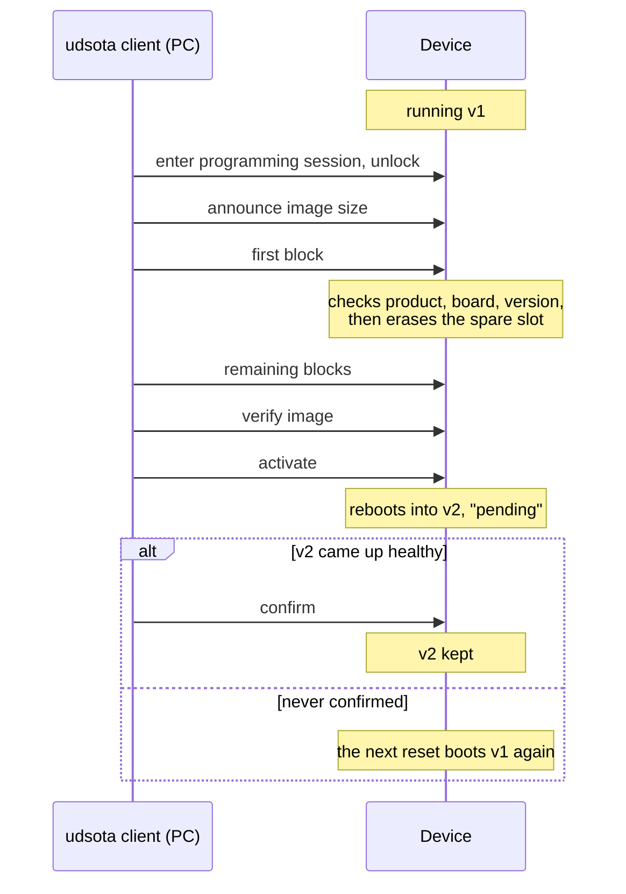
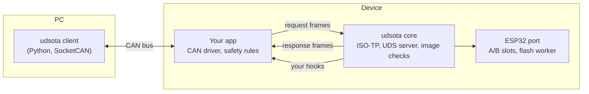

# udsota

[](https://github.com/ramb0t/udsota/actions/workflows/ci.yml)

**Firmware updates over CAN, using standard UDS diagnostics.**

udsota puts a small update server on your device and gives you a command-line tool to drive it. The new firmware goes into a spare slot. The device only keeps it once it has booted and been confirmed, so a bad update rolls back instead of bricking the unit.

- **Works with standard tools.** The device speaks UDS (ISO 14229) over ISO-TP, so any UDS tester can drive it. A Python client is included.
- **Safe A/B updates.** The running firmware is never overwritten. A new image that is never confirmed is dropped at the next reset.
- **Checked before anything is erased.** The first block of an image is checked for product, board and version, and the whole image is verified before the device switches to it.
- **Your product decides when.** Optional hooks let the app refuse any step, for example while a vehicle is moving.
- **Locked down.** Unlocking uses ECDSA signatures (the device holds only a public key) or HMAC keys.
- **Portable.** The core is plain C11 with no platform headers. An ESP-IDF port for the ESP32 family is included.

## How an update works



The client runs this whole sequence with one command. In UDS terms it is `10 02`, `27`, `34`, `36`…, `37`, then routines `FF01` (verify), `F001` (activate) and `F002` (confirm). The [wire reference](components/udsota/README.md#wire-reference) has every byte.

## How it fits together



Your app keeps ownership of the CAN bus. It hands request frames to udsota and sends the frames udsota gives back. udsota never touches the CAN controller itself.

## Quick start

You need [ESP-IDF v6.1](https://docs.espressif.com/projects/esp-idf/) for the device, and Linux with Python 3.11+, SocketCAN and the kernel's ISO-TP module (`can-isotp`) for the client.

**1. Put the example on a board** (over serial, the first time only):

```sh
idf.py -C examples/esp32 set-target esp32s3 build flash
```

**2. Install the client:**

```sh
pip install ./client
```

**3. Talk to the board over CAN:**

```console
$ udsota --profile example --interface can0 info
F189 version: v0.1.0
F18C device ID: 02:00:00:00:00:01
F1F0 update status: running slot 0 VALID, boot slot 0, other slot EMPTY v0.0.0 sha 0000000000000000, flags none
F191 board: devkit
...
```

**4. Update it over CAN:**

```console
$ udsota --profile example --interface can0 flash examples/esp32/build/example.bin
image v0.2.0 for devkit, 8272 bytes, app_elf_sha256 9fbe06d0103176b8
sent 8272 of 8272 bytes
activated; waiting for the server to restart
the server runs v0.2.0; confirming
confirmed: running slot 1 VALID, boot slot 1, other slot UNVERIFIED v0.1.0 sha 8c807b66253a6143, flags none
```

This output comes from the Linux demo server (below), so the sizes and hashes will differ on a real board.

> [!WARNING]
> The example has no security and no safety rules, so any node on the bus can reprogram it. Before shipping, add a gate hook and an ECDSA key, and turn on signed images. See [Integrating safely](components/udsota/README.md#integrating-safely).

## Add it to your ESP32 app

The whole integration is one C file. This is the core of it:

```c
#include "udsota_esp32.h"

/* Allow updates only while parked. */
static uint8_t gate(void *ctx, udsota_op_t op)
{
    return app_parked() ? 0 : UDSOTA_NRC_CONDITIONS_NOT_CORRECT;
}

void app_updater_start(void)
{
    static const udsota_config_t cfg = {
        .req_id = 0x710, .resp_id = 0x718,          /* the CAN IDs the tester uses */
        .product = "my-product", .hw_id = 1, .layout_id = 1,
    };
    const udsota_hooks_t hooks = { .gate = gate };
    const udsota_esp32_can_t can = { .can_send = app_can_send };
    udsota_esp32_start(&cfg, &hooks, &can);
}

/* In your CAN receive path: hand request frames to udsota. */
if (id == 0x710) {
    udsota_esp32_on_frame(id, data, dlc, rx_us);
}
```

Then mark your image so the device can check it before erasing:

```c
UDSOTA_ESP32_IMAGE_DESC(1, 1, 0x710, 0x718);   /* hw_id, layout_id, request ID, response ID */
```

```cmake
udsota_esp32_image_desc(${COMPONENT_LIB})     # in CMakeLists.txt, after idf_component_register()
```

The [core README](components/udsota/README.md#integrating-on-esp32) has the full version, with a confirm rule, a drive interlock and the ECDSA key. [`examples/esp32`](examples/esp32/README.md) is a complete app.

## Describe your product to the client

The client reads product details from a small TOML profile:

```toml
[can]
req_id = 0x710
resp_id = 0x718

[image]
product = "my-product"   # refuse images built for anything else
hw_ids = [1]

[security]
mode = "ecdsa"
private_key_file = "udsota_private.pem"   # from `udsota keygen`
```

`udsota keygen --out keys/` makes the key pair. The public half gets built into the firmware, and the private half stays with you. The [client README](client/README.md) lists every option.

## Try it without hardware

The Linux demo server runs the real udsota core on your PC, with emulated A/B slots and rollback:

```sh
cmake -S . -B build && cmake --build build -j
ctest --test-dir build --output-on-failure        # C unit tests and fuzzing
python -m pytest client/tests                     # client tests, including full updates against the demo
```

To drive it by hand over a virtual CAN bus:

```sh
sudo modprobe vcan && sudo modprobe can-isotp
sudo ip link add dev vcan0 type vcan && sudo ip link set up vcan0
build/tools/linux_server/udsota_demo_server --socketcan vcan0 &
udsota --profile example --interface vcan0 info
```

See [`tools/linux_server`](tools/linux_server/README.md) for its options.

## What's in the repo

| Path | What it is |
|---|---|
| [`components/udsota`](components/udsota/README.md) | The portable core. Its README is the integration guide and the protocol reference |
| [`components/udsota_esp32`](components/udsota_esp32/README.md) | The ESP-IDF port: A/B slots and rollback on `esp_ota_*`, keys, tasks |
| [`components/isotp`](components/isotp) | Vendored [isotp-c](https://github.com/SimonCahill/isotp-c) v1.9.3 |
| [`components/udsota_inflate`](components/udsota_inflate) | Raw DEFLATE for compressed downloads, on the ROM's tinfl or vendored miniz 3.0.2 |
| [`components/udsota_delta`](components/udsota_delta) | Delta-patch decoding for delta downloads, on vendored detools 0.53.0 |
| [`examples/esp32`](examples/esp32/README.md) | A minimal app that takes updates over the ESP32's CAN controller |
| [`client`](client/README.md) | The `udsota` command-line tool |
| [`tools/linux_server`](tools/linux_server/README.md) | The Linux demo server |
| `test`, `tools` | Unit tests, and `image_check`, which runs the device's first-block check on a built image |

## Status

What has changed, and what is not released yet, is in the [changelog](CHANGELOG.md). udsota was developed and bench-tested on an ESP32-S3 in a CAN-connected product. It only supports classic CAN with 11-bit IDs for now. The rest of its limits are under [Known limits](components/udsota/README.md#known-limits).

Releases follow [RELEASING.md](RELEASING.md).

MIT licence. Third-party code is listed in [THIRD_PARTY.md](THIRD_PARTY.md).
