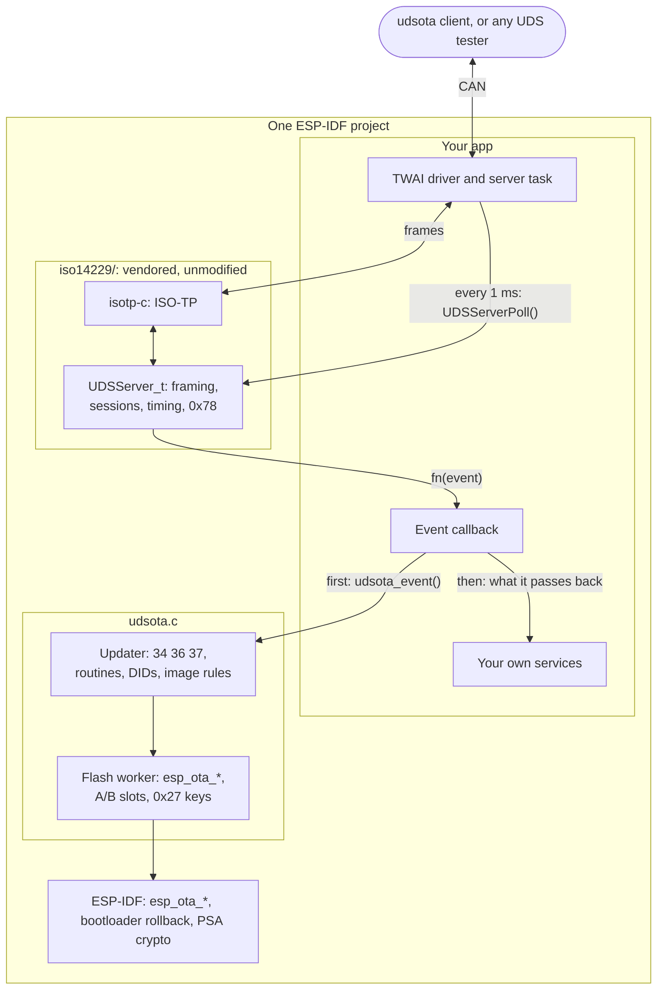

# udsota

**Safe A/B firmware updates over CAN for an ESP32 that runs [iso14229](https://github.com/driftregion/iso14229)'s UDS server. It is two files, `udsota.c` and `udsota.h`, and one line in the event callback you already have.** Any UDS tester can then update the device. Each image is checked before anything is erased, verified before it boots, and rolled back if it is never confirmed. This branch, `poc/udsota-lite`, is an experiment; `main` still has udsota's own UDS server.

```c
#include "udsota.h"

UDSOTA_IMAGE_DESC(1, 1, 0x7E6, 0x7EE);           // hw_id, partition layout, request ID, response ID

void app_main(void)
{
    udsota_init(&(udsota_cfg_t){ .key_pubkey = pubkey, .key_pubkey_len = sizeof pubkey });
    // ... start iso14229 as before: UDSServerInit, the transport, the task that calls UDSServerPoll
}

static UDSErr_t on_event(UDSServer_t *srv, UDSEvent_t ev, void *arg)   // iso14229's fn
{
    UDSErr_t rc;
    if (udsota_event(srv, ev, arg, &rc)) {
        return rc;                                // an update's event: udsota answered it
    }
    // ... your own services: DTCs, config writes, DIDs, routines
}
```

The app keeps iso14229 entirely. udsota claims only what an update needs: `10 01/02/03`, `11 01`, `27` levels 01/02 and 03/04 (when keys are set), DIDs F186, F189, F18C and F1F0–F1F3, routines FF01 and F000–F002, a `34` to address 0, and the `36`s and `37` of its own transfer. Every other service, DID, routine, session, security level and transfer (a `34` elsewhere, `35`, `38`) passes back to the app, so it can serve its own fault codes, config writes and file transfers. `udsota_busy()` tells the app when an update is running, and the optional `gate` callback lets it refuse any step, for example while the vehicle moves.

## How it fits together



An update runs `10 02`, `27 03/04`, `34`, `36`…, `37`, `31 01 FF01` (verify), `31 01 F001` (activate, and the device restarts), then `10 03` and `31 01 F002` (confirm). `udsota flash` in [`client/`](client/README.md) does all of it. The first block is held until its product, board, partition layout, CAN IDs, version and chip match this device, and only then does the slot start to fill. The blocks may be the image as it is (DFI 00) or raw DEFLATE (DFI 10), which the ESP32's ROM inflates. Flash work runs on a worker task while iso14229 answers 0x78, and each block erases only the sectors it writes, so the erase is spread over the download. With `CONFIG_BOOTLOADER_APP_ROLLBACK_ENABLE`, an image that is never confirmed rolls back at the next reset.

## Adding it to a project

Copy this directory into your project's `components/` as `udsota` (or add it with `EXTRA_COMPONENT_DIRS`), and add `udsota` to `main`'s requirements. If your app already has iso14229, use one copy of it. Then:

- Place `UDSOTA_IMAGE_DESC` once in the app. It is this image's identity, and every image you send must carry a matching one.
- Set `CONFIG_BOOTLOADER_APP_ROLLBACK_ENABLE=y`, and give the partition table two OTA slots.
- Pick 0x27 keys. With `key_pubkey`, the tester signs each seed and the device holds only the public key (`udsota keygen` makes the pair). With `key_label` and `key_master`, each device's key is derived from a master that every image carries. With neither, 0x27 is the app's and downloads need no key, so any node on the bus can update the unit. Turn on ESP-IDF's app signing too, so the verify step refuses an image you did not sign.

A version is `PROJECT_VER`. A clean `X.Y.Z` is a release, which a device takes only when it is newer than the one it runs. Anything with a suffix is a dev build, taken when its `X.Y.Z` is at least the running one's. [`examples/candash_ws43`](examples/candash_ws43/README.md) is a complete app.

## Known limits

iso14229 is used as it is, and these follow from it. They are candidates for upstream fixes.

- S3 restarts only on `10` and `3E`, not on every request, so a tester keeps the session with `3E` (the client sends one whenever 2 s have passed). The one exception udsota makes: while its own flash job runs, it holds the session, for up to 90 s.
- The security level survives a session change, so `10 01` then `10 02` stays unlocked.
- iso14229 answers no 0x78 to `27`, and counts one as a failed key. An ECDSA key takes about 0.45 s to check on an ESP32-S3 (P-256 in software), so its answer comes after P2; the client waits 2 s for it.
- Timers compare as signed 32-bit differences: after 24.9 days of uptime, 0x27 answers 0x37 until day 49.7, and a server idle that long holds its next answer.
- A `36` resent after its `76` was lost gets 0x24 and ends the transfer; a resent `37` gets 0x70. The positive answer to `10` carries iso14229's client P2 defaults.
- ISO-TP frames are not padded and N_Bs and N_Cr are 100 ms. `-DISO_TP_FRAME_PADDING` and `-DISO_TP_DEFAULT_RESPONSE_TIMEOUT_US=1000000` change both without patching iso14229.

udsota itself drops what `main` had for delta downloads, the boot-loop breaker, the ISO-TP counters (F1F2) and functional addressing. `udsota.h` ends with the platform functions a port to another MCU would supply; the host test supplies them too.

## Where everything is

| Path | What it is |
|---|---|
| `udsota.c`, `udsota.h` | udsota: the updater, iso14229's events, and the ESP-IDF platform |
| `iso14229/` | iso14229 at upstream `d018adc7` (0.11.0 and 31 commits), unmodified, with its MIT licence |
| `CMakeLists.txt` | The ESP-IDF component, or on a host the test build |
| [`examples/candash_ws43`](examples/candash_ws43/README.md) | An app on the CANDash ws43 (ESP32-S3) with CANDash's identity, so updates go both ways |
| `test/test_udsota.c` | End-to-end on the host: iso14229's mock transport, a RAM slot, raw-DEFLATE images, ASan and UBSan |
| [`client/`](client/README.md) | The `udsota` command-line tool, for Linux with SocketCAN |

```sh
cmake -S . -B build && cmake --build build -j && ctest --test-dir build   # the host test
python -m pytest client/tests                                              # the client's
```

MIT licence. Third-party code is listed in [THIRD_PARTY.md](THIRD_PARTY.md).
