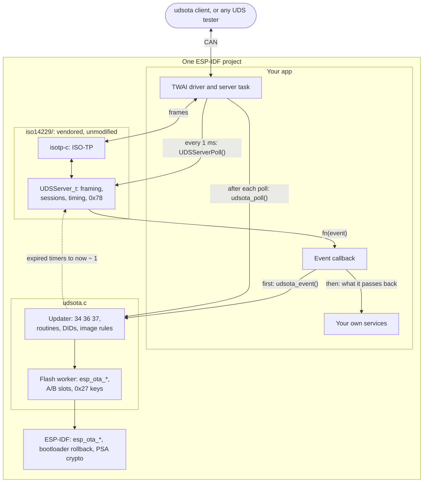

# udsota-lite

**Safe A/B firmware updates over CAN for an ESP32 that runs [iso14229](https://github.com/driftregion/iso14229)'s UDS server: two files, `udsota.c` and `udsota.h`, a call in the event callback you already have, and one after each `UDSServerPoll`.** Any UDS tester can then update the device. Each image is checked before anything is erased, verified before it boots, and rolled back if it is never confirmed. This is the experimental branch `poc/udsota-lite`; `main` is udsota with its own UDS server.

```c
#include "udsota.h"

UDSOTA_IMAGE_DESC(1, 1, 0x7E6, 0x7EE);           // hw_id, partition layout, request ID, response ID

void app_main(void)
{
    udsota_init(&(udsota_cfg_t){ .key_pubkey = pubkey, .key_pubkey_len = sizeof pubkey });
    // ... start iso14229 as before: UDSServerInit, the transport, and the task that calls UDSServerPoll,
    //     with udsota_poll(&srv) after each UDSServerPoll
}

static UDSErr_t on_event(UDSServer_t *srv, UDSEvent_t ev, void *arg)   // iso14229's fn
{
    UDSErr_t rc;
    if (udsota_event(srv, ev, arg, &rc)) {
        return rc;                                // an update's event: udsota answered it
    }
    // ... your own services: DTCs, config writes, DIDs, routines
}
```

The app keeps iso14229, the CAN bus and every service an update doesn't need. udsota answers only `10 01/02/03`, `11 01`, `27` at levels 01/02 and 03/04 (when keys are set), DIDs F186, F189, F18C, F1F0, F1F1 and F1F3, routines FF01 and F000–F002, a `34` to address 0, and the `36`s and `37` of its own transfer. Every other service, DID, routine, session, security level and transfer (a `34` elsewhere, `35`, `38`) passes back to the app. An accepted `10 01/02/03` relocks every level and ends any transfer, the app's included, because iso14229 on its own keeps both across a `10`. A `10` to one of the app's own sessions is the app's, and so is any relock it needs.

`udsota.h` documents the app's hooks. The ones an app most often needs: `udsota_busy()` says an update is running; the optional `gate` callback refuses the steps `udsota_op_t` lists, for example while the vehicle moves; and `udsota_end_session(srv)`, called on the server's task between polls and never from the event callback, ends a session with udsota's own abort and relock, for example when another tester appears.

## How it fits together



An update runs `10 02`, `27 03/04`, `34`, `36`…, `37`, `31 01 FF01` (verify) and `31 01 F001` (activate; the device restarts), then `10 03` and `31 01 F002` (confirm). `udsota flash` in [`client/`](client/README.md) does all of it. The first block is held until its product, board, partition layout, CAN IDs, version and chip match this device, and only then does the slot start to fill. Blocks carry the image as it is (DFI 00) or as raw DEFLATE (DFI 10), which the ESP32's ROM inflates. Flash work runs on a worker task while iso14229 answers 0x78, and each block erases only the sectors it writes, so the erase is spread over the download. With `CONFIG_BOOTLOADER_APP_ROLLBACK_ENABLE`, an image that is never confirmed rolls back at the next reset.

## Adding it to a project

[`examples/candash_ws43`](examples/candash_ws43/README.md) is a complete app. Copy or link this directory into your project's `components/` as `udsota`, and add `udsota` to `main`'s requirements. The component builds iso14229 from `iso14229/` with `-fwrapv` (see Known limits), so an app with its own copy drops it. Then:

- Call `udsota_poll(srv)` after every `UDSServerPoll`, on the server's task. It keeps iso14229's timers from wrapping after 24.86 days of uptime.
- Place `UDSOTA_IMAGE_DESC` once in the app. It is this image's identity, and every image you send must carry a matching one.
- Set `CONFIG_BOOTLOADER_APP_ROLLBACK_ENABLE=y`, and give the partition table two OTA slots.
- Pick 0x27 keys. With `key_pubkey`, the tester signs each seed and the device holds only the public key (`udsota keygen` makes the pair). With `key_label` and `key_master`, each device's key is derived from a master that every image carries. With neither, 0x27 is the app's and downloads need no key, so any node on the bus can update the unit. Turn on ESP-IDF's app signing too, so the verify step refuses an image you did not sign.

A version is `PROJECT_VER`. A clean `X.Y.Z` is a release, which a device takes only when it is newer than the one it runs. Anything with a suffix is a dev build, taken when its `X.Y.Z` is at least the running one's. `cfg.allow_downgrade` lifts this rule alone, for a dev unit; leave it off in a release build.

## Known limits

Lite leaves out four things `main` has: delta downloads (the client's `--diff-from` gets 0x31 to each delta `34` and sends the full image), the boot-loop breaker, the ISO-TP counters (F1F2) and functional addressing. The rest come from using iso14229 as it is, and each is a candidate for an upstream fix:

- S3 restarts only on `10` and `3E`, not on every request, so a tester keeps a session with `3E`; the client sends one before any request or 0x21 retry that comes 2 s or more after the last `10` or `3E`. During udsota's own flash job the tester waits on 0x78s and can't send one, so udsota holds the session itself, for up to 90 s.
- `27` gets no 0x78, because iso14229 counts a pending answer as a failed key. A P-256 signature takes about 0.45 s to check on an ESP32-S3, past P2, so the client waits up to 2 s for that answer.
- A lost positive answer to a `36` or `37` fails the run, and the next run starts from the first byte. The resent `36` gets 0x24, which ends the transfer, and the resent `37` gets 0x70, which the client doesn't take as the first one's success.
- The answer to `10` carries iso14229's client defaults, P2 150 ms and P2* 1500 ms. udsota raises that P2* to the server's own (5000 ms), because the server's 0x78s come every 1.5 s and would race 1500 ms.
- ISO-TP frames are not padded, and N_Bs and N_Cr are 100 ms. Compile definitions `ISO_TP_FRAME_PADDING` and `ISO_TP_DEFAULT_RESPONSE_TIMEOUT_US=1000000` change both without touching iso14229's code. In an ESP-IDF project they go in the `COMPILE_DEFINITIONS` build property; `idf.py -D` sets CMake variables, not these.
- isotp-c's timer check subtracts as `int32_t`, which overflows each time its 32-bit µs clock passes 2³¹, every 71.6 minutes. At -O1 and above, GCC and Clang fold it to a compare that ends a transfer in flight with a false N_Bs or N_Cr timeout. The component compiles `iso14229.c` with `-fwrapv`, a build flag rather than a change to iso14229, and `test_isotp_wrap` fails without it. An app that builds its own copy of iso14229 needs the flag too.

**Uptime past 24.86 days.** iso14229 compares its millisecond deadlines as signed 32-bit differences, which read an expired deadline as pending again once it is 2³¹ ms (24.86 days) old. `udsota_poll` keeps them younger than that. An app that doesn't call it after every `UDSServerPoll` meets both failures. A request that comes more than 24.86 days after the server's last answer, or after `UDSServerInit` if it has answered nothing, gets its answer only 49.71 days after that, and nothing else is read meanwhile. From 24.86 to 49.71 days after `UDSServerInit`, or after a failed key, every `27` gets 0x37, or 0x36.

## What udsota sets in iso14229

udsota never changes iso14229's code. Where iso14229 has no call for what an update needs, udsota sets the server's state itself, here and nowhere else:

- `securityLevel` and `xferIsActive`, cleared on every accepted `10 01/02/03` and S3 timeout, and `sessionType` too when udsota ends a session: its own, or the app's through `udsota_end_session`.
- `xferTotalBytes`: a raw-DEFLATE download's byte limit, raised to the stream's bound, because iso14229 counts the bytes against memorySize, the inflated image's size.
- `ecuResetScheduled` and `ecuResetTimer`: the restart after ActivateImage, at least 60 ms after its answer. Unlike iso14229's own `11 01`, it keeps reading requests until then.
- `s3_session_timeout_timer`, during udsota's own flash job.
- `p2_timer`, `sec_access_boot_delay_timer` and `sec_access_auth_fail_timer`, in `udsota_poll`: each that has expired moves to now − 1 on every pass, which still reads as expired, so none gets old enough to wrap.
- In event arguments, as iso14229 provides: the `10`'s `p2_star_ms`, raised to the server's P2*, and `maxNumberOfBlockLength` in udsota's own `34`s.

## Where everything is

| Path | What it is |
|---|---|
| `udsota.c`, `udsota.h` | The updater, iso14229's events and the ESP-IDF platform. `udsota.h` ends with the platform functions a port to another MCU would supply |
| `iso14229/` | iso14229, vendored unmodified, with its MIT licence and `SHA256SUMS`, which CI checks; its commit is in [THIRD_PARTY.md](THIRD_PARTY.md) |
| `CMakeLists.txt` | The ESP-IDF component, or on a host the tests |
| [`examples/candash_ws43`](examples/candash_ws43/README.md) | An app on the CANDash ws43 (ESP32-S3) with CANDash's identity, so updates go both ways |
| `test/test_udsota.c` | The host test: updates through iso14229's mock transport into a RAM slot, plain and raw DEFLATE, under ASan and UBSan |
| `test/e2e/` | `udsota_lite_server`: udsota and iso14229 as a Linux process with RAM A/B slots, for the client's end-to-end test |
| [`client/`](client/README.md) | The `udsota` command-line tool, copied from udsota's releases, for Linux with SocketCAN |

```sh
cmake -S . -B build && cmake --build build -j && ctest --test-dir build   # the host test; also builds udsota_lite_server
pip install "./client[diff]" pytest && python -m pytest client/tests      # the client's tests, and the end-to-end test
```

MIT licence. Third-party code is listed in [THIRD_PARTY.md](THIRD_PARTY.md).
