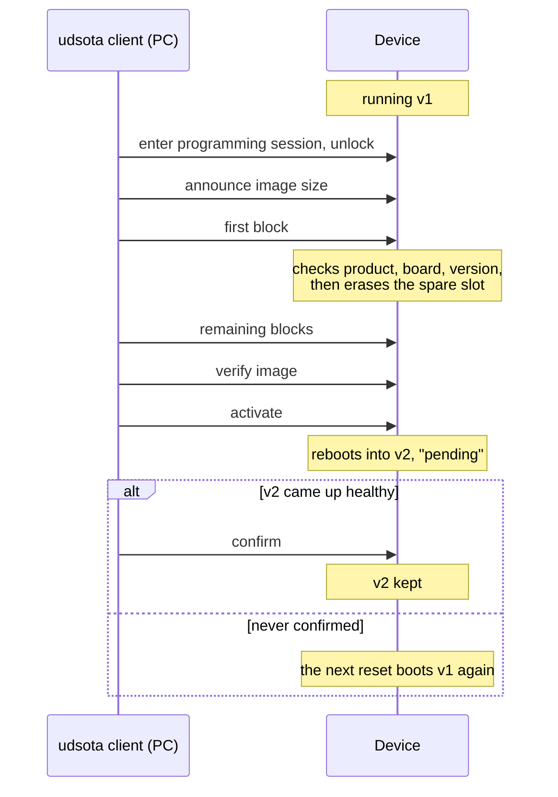
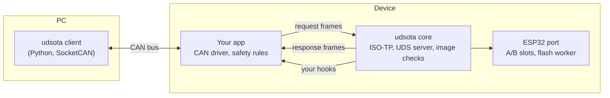

# udsota

[](https://github.com/ramb0t/udsota/actions/workflows/ci.yml)

**A device's UDS server over CAN, with firmware update as its main service.**

udsota puts a small UDS diagnostic server on your device, whose main service installs firmware, and gives you a command-line tool to drive it. The new firmware goes into a spare slot. The device only keeps it once it has booted and been confirmed, so a bad update rolls back instead of bricking the unit.

- **Works with standard tools.** The device speaks UDS (ISO 14229) over ISO-TP, so any UDS tester can drive it. A Python client is included.
- **Safe A/B updates.** The running firmware is never overwritten. A new image that is never confirmed is dropped at the next reset.
- **Checked before anything is erased.** The first block of an image is checked for product, board and version, and the whole image is verified before the device switches to it.
- **Your product decides when.** Optional hooks let the app refuse any step, for example while a vehicle is moving.
- **Your own diagnostics too.** The same server answers the app's own DIDs, writes, routines and fault codes (DTCs) through hooks ([how](components/udsota/README.md#adding-dids-routines-and-services)).
- **Locked down.** Unlocking uses ECDSA signatures (the device holds only a public key) or HMAC keys.
- **Portable.** The core is plain C11 with no platform headers. An ESP-IDF port for the ESP32 family is included.

## How an update works



The client runs this whole sequence with one command, `udsota flash`. Each step is there so that a bad update fails safe:

**Precheck.** Before it opens a session, the client checks the image file against the product profile and reads the device's update status (F1F0), running image (F1F3) and board. It does nothing if the device already runs the image, only confirms it if an earlier run stopped short of that, and skips the download if the spare slot already holds the image, verified since the device last booted.

**Unlock.** The programming session (`10 02`), then, with security on, SecurityAccess (`27`), which proves the tester holds the key (see [Key management](#key-management)).

**Download.** RequestDownload (`34`) announces the image's size, TransferData (`36`) blocks carry it, and RequestTransferExit (`37`) ends it. The device holds the first 320 bytes until it has checked the product, board, partition layout, CAN IDs and version against its own, and only then erases the spare slot, so a wrong image costs nothing. The blocks carry the image as it is, compressed as raw DEFLATE (usually 50–65 % of the time on the bus), or as a patch from the image the device runs (kilobytes for a small change).

**Verify.** Routine `FF01` checks the whole image in flash: its hash, its signature when the build checks signatures, and the first-block rules again.

**Activate and confirm.** Routine `F001` makes the spare slot the boot slot and restarts the device. Once the device answers again and reports the new image, the client sends routine `F002` in the extended session, retrying for up to 120 s while your app's own health checks run. With ESP-IDF's rollback on (step 3), the image stays "pending verify" until then, and its next reset (a power cycle, crash or watchdog) boots the old image again, so an image whose CAN path is broken does not stick.

The [wire reference](components/udsota/README.md#wire-reference) has every byte, and the retries the client makes when a frame or an answer is lost.

## How it fits together



Your app keeps ownership of the CAN bus. It hands request frames to udsota and sends the frames udsota gives back. udsota never touches the CAN controller itself.

## Quick start

You need [ESP-IDF v6.1](https://docs.espressif.com/projects/esp-idf/) for the device, and Linux with Python 3.11+, SocketCAN and the kernel's ISO-TP module (`can-isotp`) for the client.

**1. Put the example on a board** (over serial, the first time only):

```sh
idf.py -C examples/esp32 set-target esp32s3 build flash
```

**2. Install the client:**

```sh
pip install ./client
```

**3. Talk to the board over CAN:**

```console
$ udsota --profile example --interface can0 info
F189 version: v0.1.0
F18C device ID: 02:00:00:00:00:01
F1F0 update status: running slot 0 VALID, boot slot 0, other slot EMPTY v0.0.0 sha 0000000000000000, flags none
F191 board: devkit
...
```

**4. Update it over CAN:**

```console
$ udsota --profile example --interface can0 flash examples/esp32/build/example.bin
image v0.2.0 for devkit, 8272 bytes, app_elf_sha256 9fbe06d0103176b8
sent 8272 of 8272 bytes
activated; waiting for the server to restart
the server runs v0.2.0; confirming
confirmed: running slot 1 VALID, boot slot 1, other slot UNVERIFIED v0.1.0 sha 8c807b66253a6143, flags none
```

This output comes from the Linux demo server (below), so the sizes and hashes will differ on a real board.

> [!WARNING]
> The example has no security and no safety rules, so any node on the bus can reprogram it. Before shipping, add a gate hook and an ECDSA key, and turn on signed images. See [Integrating safely](components/udsota/README.md#integrating-safely).

## How to use it

A product takes five steps: add the server to your app, describe the product to the client, then build, flash and, when a flasher other than the client does the updates, pack each release.

### 1. Add it to your ESP32 app

The whole integration is one C file. This is the core of it:

```c
#include "udsota_esp32.h"
#include "udsota_pubkey.h"   /* from `udsota keygen`: the public key, so it unlocks nothing (Key management) */

/* Allow updates only while parked. */
static uint8_t gate(void *ctx, udsota_op_t op)
{
    return app_parked() ? 0 : UDSOTA_NRC_CONDITIONS_NOT_CORRECT;
}

void app_updater_start(void)
{
    static const udsota_config_t cfg = {
        .req_id = 0x710, .resp_id = 0x718,          /* the CAN IDs the tester uses */
        .product = "my-product", .hw_id = 1, .layout_id = 1,
        .key_pubkey = udsota_pubkey, .key_pubkey_len = sizeof udsota_pubkey,
    };
    const udsota_hooks_t hooks = { .gate = gate };
    const udsota_esp32_can_t can = { .can_send = app_can_send };
    udsota_esp32_start(&cfg, &hooks, &can);
}

/* In your CAN receive path: hand request frames to udsota. */
if (id == 0x710) {
    udsota_esp32_on_frame(id, data, dlc, rx_us);
}
```

Then mark your image so the device can check it before erasing:

```c
UDSOTA_ESP32_IMAGE_DESC(1, 1, 0x710, 0x718);   /* hw_id, layout_id, request ID, response ID */
```

```cmake
udsota_esp32_image_desc(${COMPONENT_LIB})     # in CMakeLists.txt, after idf_component_register()
```

The [core README](components/udsota/README.md#integrating-on-esp32) has the full version, with a confirm rule, a drive interlock and the ECDSA key. [`examples/esp32`](examples/esp32/README.md) is a complete app.

### 2. Describe your product to the client

The client reads product details from a small TOML profile:

```toml
[can]
req_id = 0x710
resp_id = 0x718

[image]
product = "my-product"   # refuse images built for anything else
hw_ids = [1]

[security]
mode = "ecdsa"
private_key_file = "udsota_private.pem"   # from `udsota keygen`
```

Save it as `my-product.toml` and pass that path to `--profile`. [Key management](#key-management) covers the key file, and the [client README](client/README.md) lists every option.

### 3. Build an image

An update is the ordinary `.bin` ESP-IDF builds, such as `examples/esp32/build/example.bin`. udsota needs nothing added to it beyond the descriptor from step 1.

`PROJECT_VER` in the project's `CMakeLists.txt` is the image's version. A clean `X.Y.Z` or `vX.Y.Z` makes a release, which a device takes only when it is newer than the image it runs, so a fleet only ever rolls forward. A version with a suffix (`1.3.0-dev`) makes a dev build, for the bench, which a device takes when its `X.Y.Z` is at least the running one's; a version that doesn't start with `X.Y.Z`, such as the git hash ESP-IDF uses when `PROJECT_VER` is unset, is refused ([image rules](components/udsota/README.md#image-rules)). For a product, turn on ESP-IDF's app signing or Secure Boot v2 and sign every build, so that the device's verify step refuses an image you did not sign ([Signing](components/udsota/README.md#signing)).

Set `CONFIG_BOOTLOADER_APP_ROLLBACK_ENABLE=y`, as the example's `sdkconfig.defaults` does. ESP-IDF leaves it off, and without it the restart after ActivateImage makes the new image permanent, confirmed or not.

Compressed and delta downloads need nothing from the image being sent: a device takes them when the image it runs was built with `CONFIG_UDSOTA_ESP32_COMPRESSION` (0x10), plus `CONFIG_UDSOTA_ESP32_DELTA` for patches. The example's `sdkconfig.compression` and `sdkconfig.delta` turn them on.

`build/udsota_image_check <image.bin> <chip_id> [product hw_id layout req_id resp_id slot_size]`, from the host build below, runs the device's first-block check on a built image, so a wrong project name, board, layout or CAN ID shows before the image reaches a device. `chip_id` is ESP-IDF's `esp_chip_id_t` (0 for esp32, 9 for esp32s3), the optional arguments default to the example's values, and it exits 0 or the [reason](components/udsota/README.md#reason-codes) it refused with.

Keep the exact `.bin` of every build you ship. A delta download is a patch from the image the device runs, and a rebuild of the same source is not byte-identical (ESP-IDF stamps the build time into the image), so the file you flashed is the only base a patch can be made from.

### 4. Flash an update

```sh
udsota --profile my-product.toml --interface can0 flash build/my-product.bin                 # the whole image
udsota --profile my-product.toml --interface can0 flash --compress build/my-product.bin      # as raw DEFLATE
udsota --profile my-product.toml --interface can0 flash --diff-from releases/ build/my-product.bin   # a patch, if one fits
```

`--diff-from` takes a directory of past release images and picks the one whose app_elf_sha256 the device reports. It falls back to a full download when none matches, when the patch would be no smaller, when the device has no delta downloads or no memory for one (0x31, or 0x22 with F1F1 reason 14), or when it runs another build than the base (`DL_BAD_BASE`). `confirm` finishes an update that stopped before ConfirmImage, and `reset` restarts the device, which rolls back an unconfirmed image. The exit code says why a run stopped ([client README](client/README.md)).

### 5. Or flash from your own tool

When something other than this client sends updates, such as a telematics unit that fetches them from your server, `udsota pack` writes the payloads `flash` sends, byte for byte, with a JSON manifest holding the sizes, hashes and identities the flasher needs:

```sh
udsota --profile my-product.toml pack build/my-product.bin --out dist/ --diff-from releases/v1.4.0.bin
```

The flasher then runs the sequence in [Flashing without the client](components/udsota/README.md#flashing-without-the-client). It still has to unlock the device; [Key management](#key-management) says how without giving it the private key.

## Key management

Two keys protect an update, and neither belongs in a repository, nor (in the ECDSA mode) in an image. The **unlock key** decides who may program a device. The **signing key** decides which images it will run. With only the first, whoever has it can install any image the image rules accept; with only the second, anyone on the bus can install any image you signed.

**The unlock key** answers SecurityAccess (`27`). Use the ECDSA mode for a product. `udsota keygen --out keys/` writes `udsota_private.pem` and `udsota_pubkey.h`. The header is public: build it into the firmware as `cfg.key_pubkey` (step 1). To unlock, the tester signs a fresh seed from the device, bound to its ID and the access level; the [Security](components/udsota/README.md#security) section gives the message and why a dump or a captured signature unlocks nothing. Three wrong keys bring a 10 s delay before the next try, and the same delay follows every boot. Keep the private key in an HSM or a signing service; the client reads a PEM file (`--private-key`, or the profile's `private_key_file`) for the bench or a signing host.

A flasher that is not a trusted host, such as an edge device, should not hold the private key either. Have it forward the seed, the level and the device ID (F18C) to your signing service and send back the 64-byte signature it returns. Keep the session open while it waits, with TesterPresent (`3E 00`) at least every 2 s, since the device drops the session and the seed after 5 s of silence. Send the signature within 30 s of the seed, and don't ask for another seed meanwhile, which replaces it. The HMAC mode instead derives each device's key from a 32-byte master that every image must carry, so one leaked image or flash dump unlocks the whole fleet. It suits a bench, or a fleet whose images and flash are both protected and whose master can be rotated.

To rotate the unlock key, build a release with the new public key and flash it, unlocking with the old one. A device checks the key built into the image it runs, so from the moment the new image boots, confirmed or not, only the new key unlocks it; ConfirmImage needs no key, so the update still completes. A device that rolls back returns to the old key, so keep both until the whole fleet has confirmed.

**The signing key** is ESP-IDF's own (app signing, or Secure Boot v2), and udsota adds nothing to it: the verify step reports a bad or missing signature. F1F0's flag 0x01 tells a client whether the running build checks signatures. Keep it in a signing service too, not on a developer's machine.

## Try it without hardware

The Linux demo server runs the real udsota core on your PC, with emulated A/B slots and rollback:

```sh
cmake -S . -B build && cmake --build build -j
ctest --test-dir build --output-on-failure        # C unit tests and fuzzing
python -m pytest client/tests                     # client tests, including full updates against the demo
```

To drive it by hand over a virtual CAN bus:

```sh
sudo modprobe vcan && sudo modprobe can-isotp
sudo ip link add dev vcan0 type vcan && sudo ip link set up vcan0
build/tools/linux_server/udsota_demo_server --socketcan vcan0 &
udsota --profile example --interface vcan0 info
```

See [`tools/linux_server`](tools/linux_server/README.md) for its options.

## What's in the repo

| Path | What it is |
|---|---|
| [`components/udsota`](components/udsota/README.md) | The portable core. Its README is the integration guide and the protocol reference |
| [`components/udsota_esp32`](components/udsota_esp32/README.md) | The ESP-IDF port: A/B slots and rollback on `esp_ota_*`, keys, tasks |
| [`components/isotp`](components/isotp) | Vendored [isotp-c](https://github.com/SimonCahill/isotp-c) v1.9.3 |
| [`components/udsota_inflate`](components/udsota_inflate) | Raw DEFLATE for compressed downloads, on the ROM's tinfl or vendored miniz 3.0.2 |
| [`components/udsota_delta`](components/udsota_delta) | Delta-patch decoding for delta downloads, on vendored detools 0.53.0 |
| [`examples/esp32`](examples/esp32/README.md) | A minimal app that takes updates over the ESP32's CAN controller |
| [`client`](client/README.md) | The `udsota` command-line tool |
| [`tools/linux_server`](tools/linux_server/README.md) | The Linux demo server |
| `test`, `tools` | Unit tests, and `image_check`, which runs the device's first-block check on a built image |

## Status

What has changed, and what is not released yet, is in the [changelog](CHANGELOG.md). udsota was developed and bench-tested on an ESP32-S3 in a CAN-connected product. It only supports classic CAN with 11-bit IDs for now. The rest of its limits are under [Known limits](components/udsota/README.md#known-limits).

Releases follow [RELEASING.md](RELEASING.md).

MIT licence. Third-party code is listed in [THIRD_PARTY.md](THIRD_PARTY.md).
