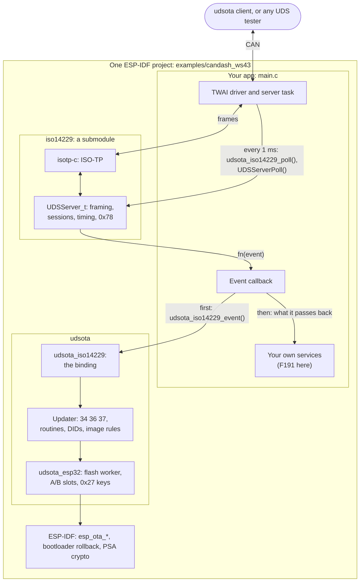
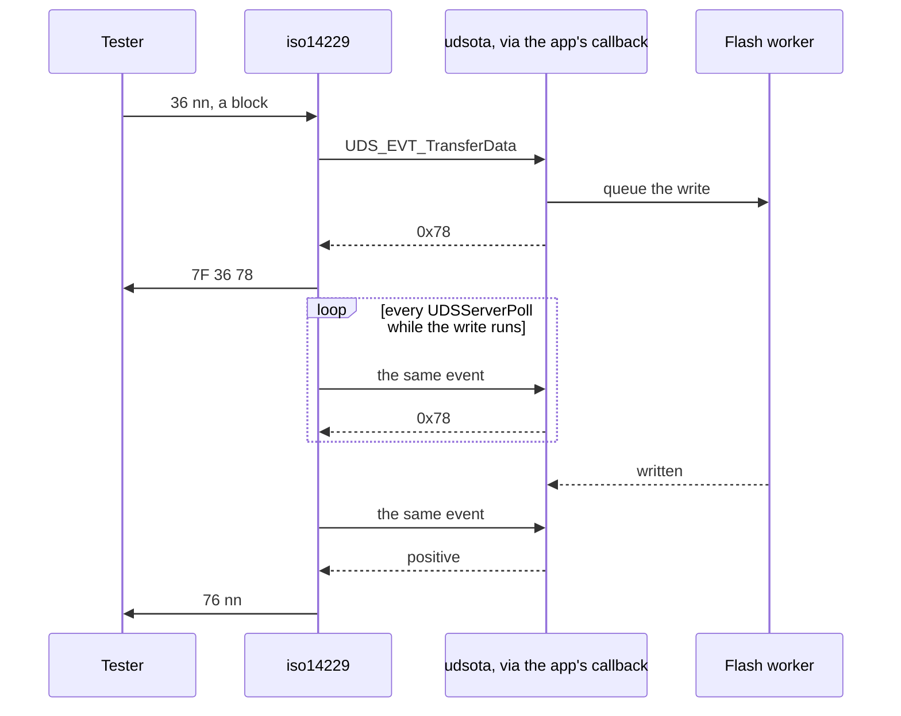

# udsota on iso14229

**udsota's firmware updater running on [iso14229](https://github.com/driftregion/iso14229)'s UDS server. This branch is an experiment and not for merge; `main` still has udsota's own server.** It shows that a product already running iso14229 can get udsota's safe over-CAN updates by adding one call to the event callback it already has, without replacing its UDS stack.

The updater writes a new image into the spare A/B slot. It checks the image before erasing anything and again before switching to it, and keeps it only once the client confirms it, so a bad update rolls back instead of bricking the unit. It was tested on a CANDash ws43 (ESP32-S3) at 250 kbit/s. CANDash's own udsota server installed this build, this build updated itself, and then it installed CANDash back, all driven by the unchanged udsota client. The [example's README](examples/candash_ws43/README.md) has the results.

## How it fits together



The app keeps everything iso14229 already asked of it: the CAN driver, the task that feeds request frames to isotp-c and calls `UDSServerPoll()`, and the event callback. The callback hands each event to `udsota_iso14229_event()` first. udsota answers the events that belong to an update and passes the rest back, and the app serves those as it did before.

iso14229 keeps ISO-TP, framing, session timing, the 0x78 cadence and the 0x27 attempt delays. udsota keeps the image: the download and its checks, the flash writes, the A/B slots, rollback and the 0x27 keys. The binding (`components/udsota_iso14229`, one C file of about 420 lines) maps iso14229's events onto the updater and fills the gaps listed in [Differences](#differences-from-udsotas-own-server).

A flash write takes longer than a UDS answer is allowed to. So the updater queues each write on its worker task and answers 0x78, and iso14229 raises the same event again on every poll until the write is done:



## How an update runs

`udsota flash` runs this whole sequence. Each step is there so that a failed update is safe:

| Step | Requests | What happens |
|---|---|---|
| Precheck | `22 F1F0`, `22 F1F3` | The client reads the slots and the running image. It skips any work already done |
| Unlock | `10 02`, `27 03/04` | The binding refuses `10 02` while a job runs or the slots are unsettled. Then it checks the key; iso14229 enforces the attempt delays |
| Download | `34`, `36`…, `37` | The first block is held until its product, board, partition layout, CAN IDs and version match this device. Only then is the spare slot erased. The blocks can be plain, raw DEFLATE, or a patch from the running image |
| Verify | `31 01 FF01` | The whole image is checked in flash: its hash, its signature, and the first-block rules again |
| Activate | `31 01 F001` | The spare slot becomes the boot slot, and the app's `reset` callback restarts the device |
| Confirm | `10 03`, `31 01 F002` | The new image is marked valid. With ESP-IDF's rollback on, an image that is never confirmed is dropped at the next reset |

For every byte, see the [wire reference](components/udsota/README.md#wire-reference) in the core README. That README describes `main`, but its DIDs, routines and reason codes are the updater's and still hold here.

## Adding it to an iso14229 app

These are the lines an iso14229 app on ESP-IDF adds. [`main.c`](examples/candash_ws43/main/main.c) is the complete version:

```c
#include "iso14229.h"
#include "udsota_esp32.h"
#include "udsota_iso14229.h"
#include "udsota_pubkey.h"                       /* from `udsota keygen` */

UDSOTA_ESP32_IMAGE_DESC(1, 1, 0x7E6, 0x7EE);    /* hw_id, layout_id, request ID, response ID */

static UDSServer_t       s_srv;                 /* the app's server, as before */
static udsota_iso14229_t s_upd;

static UDSErr_t on_event(UDSServer_t *srv, UDSEvent_t ev, void *arg)
{
    UDSErr_t rc;
    if (udsota_iso14229_event(&s_upd, srv, ev, arg, &rc)) {
        return rc;                               /* the updater answered */
    }
    /* ... the app's own services, unchanged ... */
}

/* Runs once 11 01 or ActivateImage has been answered. */
static void restart(void *ctx) { esp_restart(); }

void updater_start(void)
{
    const udsota_config_t cfg = {
        .req_id = 0x7E6, .resp_id = 0x7EE, .product = "my-product", .hw_id = 1, .layout_id = 1,
        .key_pubkey = udsota_pubkey, .key_pubkey_len = sizeof udsota_pubkey,
    };
    udsota_esp32_updater_t port;                 /* the engine, 0x27 security and device ID */
    ESP_ERROR_CHECK(udsota_esp32_updater_start(&cfg, NULL, &port));
    const udsota_iso14229_cfg_t bind = {
        .engine = port.engine, .security = port.security,
        .device_id = port.device_id, .device_id_len = port.device_id_len,
        .reset = restart,
    };
    udsota_iso14229_init(&s_upd, &bind);
    s_srv.fn = on_event;
}

/* In the server task, as often as it already polls: */
udsota_iso14229_poll(&s_upd, &s_srv);
UDSServerPoll(&s_srv);
```

`udsota_iso14229_poll()` keeps expired timers from coming back to life. iso14229 compares deadlines as signed 32-bit differences, so without it 0x27 answers 0x37 between 24.9 and 49.7 days of uptime. `gate` in `udsota_iso14229_cfg_t` lets the app refuse any update step, for example while the vehicle is moving, and `progress` reports the download for a display.

The project's `CMakeLists.txt` adds `components/` to `EXTRA_COMPONENT_DIRS`, and `main` calls `udsota_esp32_image_desc(${COMPONENT_LIB})` after `idf_component_register()`. `sdkconfig` needs `CONFIG_BOOTLOADER_APP_ROLLBACK_ENABLE=y`: without it, the restart after ActivateImage makes the new image permanent, confirmed or not. `CONFIG_UDSOTA_ESP32_COMPRESSION` and `CONFIG_UDSOTA_ESP32_DELTA` let the running image take compressed downloads and patches.

**Keys.** 0x27 uses ECDSA when `cfg.key_pubkey` is set: the device holds only the public key, and the tester signs its seed. With `key_label` and `key_master` set instead, it uses per-device HMAC keys. With neither, the updater leaves 0x27 to the app and downloads need no key, so any node on the bus can reprogram the unit. The bench ran the HMAC mode; ECDSA is wired through but was not run on this branch. Images are signed with ESP-IDF's own app signing, which the verify step checks. The core README's [Security](components/udsota/README.md#security) section covers both keys.

## Driving an update

The client is unchanged from `main`. It needs Linux with SocketCAN and the kernel's ISO-TP module, and a TOML profile that describes the product ([client README](client/README.md)):

```sh
pip install ./client
udsota --profile my-product.toml --interface can0 info
udsota --profile my-product.toml --interface can0 flash --compress build/my-product.bin
udsota --profile my-product.toml --interface can0 flash --diff-from releases/ build/my-product.bin
```

## Differences from udsota's own server

A tester sees these changes:

- **Transfers.** Every 36 is answered `7F 36 78` before `76`. A resent 36 whose `76` was lost gets 0x24 instead of a repeat of the `76`. Any NRC to a 36 or 37 ends the transfer. A 36 or 37 with no transfer open gets 0x70 instead of 0x24, so a resent 37 whose `77` was lost fails the update.
- **0x27.** The boot delay is 1 s, and each wrong key costs 1 s. udsota's server used a 10 s delay and a lockout after three wrong keys. Inside the delay, iso14229 answers 0x36 where 0x37 is expected.
- **Gone.** F1F2's counters, the STmin monitor, functional addressing and the app hooks for 19, 14, 28, 85, 2E and app routines. An app serves those in its own callback.

The binding covers three iso14229 gaps:

- iso14229 restarts S3 only on 10 and 3E.
- Its answer to 10 xx carries the client's P2 defaults.
- It keeps the security level across a session change.

## Where everything is

| Path | What it is |
|---|---|
| [`components/iso14229`](components/iso14229) | iso14229 at upstream `d018adc7` (0.11.0 and 31 commits) as a git submodule in `iso14229/`, and a `CMakeLists.txt` that builds it as an ESP-IDF component or a host library |
| [`components/udsota_iso14229`](components/udsota_iso14229) | The binding: `udsota_iso14229.h` is the whole API an iso14229 app calls |
| [`components/udsota/update`](components/udsota/update) | The updater, which knows no server: `udsota_update.c` answers 34, 36, 37, the routines and the DIDs. Also the image rules, and the stages for compressed downloads and patches |
| [`components/udsota/common`](components/udsota/common) | What the updater and its ports share: the config, the 0x27 security interface and key derivation, and the server-side wire constants |
| [`components/udsota/include`](components/udsota/include) | `udsota.h`, the public header, and `udsota_wire.h`, every value on the wire |
| [`components/udsota/bootloop`](components/udsota/bootloop) | The boot-loop breaker: after repeated crash resets, boot ignoring stored config |
| [`components/udsota_esp32`](components/udsota_esp32) | The ESP-IDF port. In `update/`, the engine on `esp_ota_*` with its flash worker and the ESP image check. In `port/`, `udsota_esp32_updater_start()`, the device ID and the 0x27 keys on PSA. `Kconfig` has the worker and download options |
| [`components/udsota_inflate`](components/udsota_inflate), [`components/udsota_delta`](components/udsota_delta) | Raw DEFLATE (ROM tinfl or vendored miniz) and patch decoding (vendored detools), unchanged from `main` |
| [`examples/candash_ws43`](examples/candash_ws43/README.md) | The example app: iso14229 and udsota in one ESP-IDF project on the CANDash ws43, with CANDash's image identity so updates go both ways |
| [`test/test_poc_e2e.c`](test/test_poc_e2e.c) | A host end-to-end test. It runs iso14229 on its mock transport with the binding, a RAM engine and a clock the test sets, under ASan and UBSan |
| [`client`](client/README.md) | The `udsota` command-line tool, unchanged |
| `tools`, `docs/plans`, `.github` | From `main`: release scripts, design plans (including the server/updater split this branch builds on) and CI |

This branch removes udsota's server and its ISO-TP (`components/isotp`), the Linux demo server, `examples/esp32` and the unit tests. The core and ESP32 READMEs, the changelog, `RELEASING.md` and CI still describe `main`.

## Build and test

```sh
git clone --recurse-submodules -b poc/iso14229 https://github.com/ramb0t/udsota
cmake -S . -B build && cmake --build build -j && ctest --test-dir build   # the host end-to-end test
```

The firmware builds with ESP-IDF v6.1 from `examples/candash_ws43`. Its README has the steps.

## Status

This is a proof of concept. Only the general case of an update has been run, on one board. CI fails on this branch because its jobs build what the branch removes. The iso14229 issues found here have not been reported upstream. MIT licence; third-party code is listed in [THIRD_PARTY.md](THIRD_PARTY.md).
